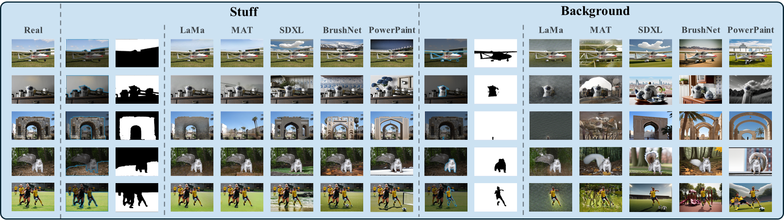

# Zooming In on Fakes: A Novel Dataset for Localized AI-Generated Image Detection with Forgery Amplification Approach

## Dataset(BR-Gen)

This dataset contains150k localized generated images, forged by traditional inpainting methods (MAT, LaMa) and text-guided inpainting methods (SDXL, BrushNet, PowerPaint). We provided the Region Masks and Localized Generated Images.

### Visual Cases

### Dataset specifications

How we created 150k localized generated images using various open-source models. We used 2 types of masks, and 5 types of inpainting methods to generated these images. Not seen in the diagram: each real image will correspond to 2 masks and 10 localized generated images.

| Generated types                             |                                           |
| ------------------------------------------- | ----------------------------------------- |
| **# masks**                                 | 2 (Stuff, Background)                     |
| **# Inpainting Methods**                    | 5 (LaMa, MAT, SDXL, BrushNet, PowerPaint) |
| **Total # generated iamges per real image** | 2 * 5 = 10                                |

| Dataset sizes                    | Training | Testing | Validation | Total   |
| -------------------------------- | -------- | ------- | ---------- | ------- |
| **# real images**                | 12,000   | 1,500   | 1,500      | 15,000  |
| **# localized generated images** | 120,000  | 15,000  | 15,000     | 150,000 |

Note, in the process of training and testing, in order  to prevent the impact o category imbalance, we sample the generated images to keep the number of real samples the same.

### Download

The **BR-Gen** dataset can be downloaded through [Baidu Netdisk]() (Password: xxxx). If you have any questions, please send an email to [lvpancai@stu.xmu.edu.cn](mailto:lvpancai@stu.xmu.edu.cn).

Considering copyright issues, the BR-Gen dataset only provides Region Masks and Forged Images. The original images were collected from datasets such as COCO, ImageNet, and Places. as detailed in **Section 3.1 Real Image Collection** of the paper.

However, we have provided the file name of the real image used in the dataset. You can extract the real image data used in this dataset from the original real data according to "**RealImage/xxxxx/xxxxx_image_list.txt**" in the path.

### License

The BR-Gen dataset is released only for academic research. Researchers from educational institutes are allowed to use this database freely for noncommercial purposes.

